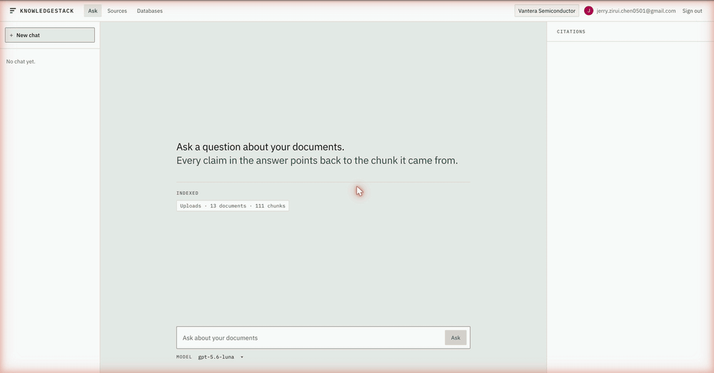

# KnowledgeStack

On a new team, even a simple question can be hard to answer when you don't know where the information lives. A design decision might be in Confluence, a setup guide in Notion, and the meaning of a database field in a wiki page. A new hire may have to ask one teammate, wait to be sent to another, then repeat the question to a third. That delay stretches out onboarding and interrupts the people who know where everything lives.

KnowledgeStack gives the team one place to ask those questions. In a workspace, they can upload documents, connect Notion or Confluence, and register PostgreSQL databases. The agent searches those documents for relevant chunks (short pieces of text), then uses them to write an answer with citations. That's retrieval-augmented generation (RAG). When a question also needs numbers, the agent reads the database schema and sample rows, uses the docs to interpret the fields, writes a read-only SQL query, and shows the query and results. This text-to-SQL step connects what the documentation says to the data it describes.

<p align="center">
  
</p>

<p align="center">
  <em>The demo shows the agent finding a wiki explanation, checking the database, and showing the sources behind its answer.</em>
</p>

## A question that needs both docs and data

Suppose a new teammate asks, "What was net revenue by quarter in 2025?" The demo database holds the order rows, but the wiki explains two rules needed to read them: `cst_typ_cd = '04'` marks an intercompany account, and `unit_px` is stored in hundredths of a cent. A query that misses the unit rule can return a believable number that is 100 times too high.

KnowledgeStack searches the wiki, checks the live database schema and sample rows, then writes and runs a read-only query. It shows numbered document citations beside the answer and the SQL and rows below it. A teammate can follow the same path to verify the result.

To try this example locally, follow [Getting started](#getting-started).

## What you can do

- Sign in with Google, create a workspace, or join one with an eight-character code. Each workspace keeps its own sources, documents, database connections, and chats, and a question reads only that workspace.
- Upload files or connect Notion and Confluence. A sync updates documents that changed and checks that a missing page was actually deleted before removing it.
- Ask a question and open the numbered citations beside the answer to see the document chunks the agent used.
- Connect a PostgreSQL database with a read-only role. The agent can inspect tables and sample rows, then run one SELECT with a 60 second timeout and a 1000 row limit.
- Continue a long conversation. When it reaches 100 turns or 256000 tokens, the app summarizes older turns and keeps the newest turns in full.
- Use the same five tools from an outside agent through the MCP (Model Context Protocol) server. A workspace token authorizes each call, and `/settings/mcp-tokens` shows the client registration command.
- OAuth tokens and database passwords are encrypted with AES-256-GCM. The database stores only SHA-256 hashes of session tokens.
- Explore the demo fixture: 24 tables, 13 wiki pages, and 20 traps that can make an SQL result look plausible but wrong unless the agent reads the wiki.

## Architecture

```
                               ┌───────────┐
                               │  Browser  │
                               └─────┬─────┘
                     /api/... with the ks_session cookie
                                     │
  ┌──────────────────────────────────▼──────────────────────────────────┐
  │  Web  ·  Next.js 16  ·  port 3000                                   │
  │  proxy.ts sends a page request that carries no cookie to /signin    │
  │  app/api/[...path] forwards every /api call and streams the answer  │
  └──────────────────────────────────┬──────────────────────────────────┘
                       API_INTERNAL_URL, server to server
                                     │
  ┌──────────────────────────────────▼──────────────────────────────────┐
  │  API  ·  NestJS 11  ·  port 3001                                    │
  │  SessionGuard runs under APP_GUARD  ·  Google OAuth signs a person  │
  └───────────────┬───────────────────────────────────┬─────────────────┘
      write path  │                                   │  read path
  ┌───────────────▼──────────────┐   ┌────────────────▼────────────────┐
  │  SyncService                 │   │  AgentLoop                      │
  │   UploadConnector            │   │   OpenAI Responses API          │
  │   NotionConnector            │   │   ToolRegistry                  │
  │   ConfluenceConnector        │   │    search_document_chunks       │
  │   createChunks, 512 tokens   │   │    list_databases, list_tables  │
  │   EmbeddingService, OpenAI   │   │    describe_tables, execute_sql │
  └───────────────┬──────────────┘   └───────┬─────────────────┬───────┘
                  │                          │                 │
                  └────────────┬─────────────┘                 │
                               │                               │
  ┌────────────────────────────▼─────┐   ┌─────────────────────▼───────┐
  │  app-db  ·  PostgreSQL 17        │   │  Business databases         │
  │  pgvector, HNSW cosine index     │   │  one pg.Pool for each row   │
  │  workspaces, sources, documents  │   │  a read-only role and       │
  │  document_chunks, chats, turns   │   │  BEGIN READ ONLY per query  │
  └──────────────────────────────────┘   └─────────────────────────────┘
```

The browser talks to Next.js, which forwards `/api/...` requests to NestJS and streams the answer back. One path turns uploaded or connected documents into searchable `document_chunks`. The other retrieves those chunks and, when needed, queries a registered business database. The application database keeps workspaces, documents, and chats separate from those business databases.

## Tech stack

- **Frontend:** Next.js 16 (App Router), React 19, TypeScript 6, CSS Modules, IBM Plex
- **Backend:** NestJS 11, Node.js 24, Express
- **Database:** PostgreSQL 17, pgvector, Prisma 7 with a split schema
- **AI:** OpenAI Responses API, `text-embedding-3-small` at 1536 dimensions, LangChain text splitters, `js-tiktoken`
- **Contract:** Zod 4 schemas in one workspace package, which both apps import and which derive every wire type
- **Infrastructure:** Docker Compose, pnpm workspaces, GitHub Actions

## How it works

There are two paths through the app. Adding a document makes its contents searchable. Asking a question retrieves relevant chunks and can also query a database.

### When you add a document

```
  a file, a Notion page, or a Confluence page
        │
        ▼  connector.listDocuments, 100 per page, cursor paged
  one row in documents, with last_seen_at set to the pass start time
        │
        ▼  connector.fetchDocumentById, only when the provider edit is newer
  the Markdown body
        │
        ▼  createChunks: mdast parse, heading path kept, 512 tokens maximum
  the chunks, each one a whole section or a whole table row
        │
        ▼  EmbeddingService, batched under 2048 inputs and 300000 tokens
  document_chunks rows, each with a vector(1536) under an HNSW cosine index
```

1. The person uploads a file, or grants access to Notion or Confluence. One OAuth callback serves both providers; its state identifies the provider. The grant creates one source per Confluence space, and the sources page runs the first pass by itself.
2. `SyncService` records the pass start time, then reads the documents of the source one page at a time.
3. Each listed document writes its metadata and takes the pass start time in `last_seen_at`.
4. A document re-indexes only when the database holds no index time for it, or when the provider edited it after that time. A re-index replaces every chunk of that document.
5. The chunker keeps the document title and heading path with each piece of text, so a line such as "A member vests after three years" still carries its section. It packs sibling sections up to 512 tokens, splits long tables by row while repeating their headers, and re-fences split code blocks.
6. After the last page, the pass reads every document it did not stamp and asks the provider about each one. It deletes only the ones the provider reports gone, because a listing that omits a live page must not delete it.

### When you ask a question

1. The browser posts the question. The API sends the stream headers before the first search, so the browser must treat a stream that ends without a `done` frame as a failure.
2. `CompactionService` measures the chat. A chat over either limit compacts first, and the browser receives the notes and the new context size.
3. `AgentLoop` calls the OpenAI Responses API with the question, the instructions and the declared tools.
4. The model calls `search_document_chunks`. The API embeds the query with the same model that embedded the chunks, then ranks every chunk of that workspace by cosine distance and returns the nearest six.
5. For a question about numbers, the model calls `list_databases`, then `list_tables`, then `describe_tables`. The last one returns the columns, the primary key, the foreign keys and five live sample rows. A name such as `cst_typ_cd` and an empty column comment state nothing; the sample rows state what the values look like.
6. The model writes one SELECT and calls `execute_sql`. The API validates it, wraps it in `SELECT * FROM (...) AS query LIMIT 1000`, and runs it in a read-only transaction.
7. If the model calls a missing tool, sends malformed arguments, or names a table that does not exist, the tool replies with a correction so the model can try again in the same answer.
8. The API streams tool steps, citations, rows, and answer text through Server-Sent Events as they arrive. Each used document chunk gets a `[n]` marker. The citation rail shows the chunk, its heading path, and its cosine similarity, and clicking the marker opens it.

## Design decisions

### Why PostgreSQL holds the vectors

One `pgvector` column in the application database keeps the chunk, its document, its source and its workspace in one row and under one transaction. A separate vector database would need a second write on every index, a second delete on every removed document, and its own copy of the workspace filter. It would also drop the `ON DELETE CASCADE` that removes the chunks of a deleted document today. An HNSW index on `vector_cosine_ops` covers the search at the scale of a team wiki. The cost is that Prisma Client cannot read an `Unsupported("vector(1536)")` column, so the search and the chunk write both use raw SQL.

### How the agent cannot write to a business database

The model writes the SQL, so the SQL is untrusted input. Five checks sit between the model and the database, and each one alone stops a write.

```
  the model writes a statement
        │
        ▼  execute_sql rejects a semicolon and anything but one SELECT or WITH
        ▼  the statement is wrapped: SELECT * FROM (...) AS query LIMIT 1000
        ▼  the pooled connection carries default_transaction_read_only=on
        ▼  every statement runs inside BEGIN READ ONLY
        ▼  the registered role holds SELECT grants only, such as agent_readonly
  the rows, at most 1000, in at most 60 seconds
```

The role that the workspace registers is the check that must hold, because it is the only one outside this codebase. The other four keep a mistake in that role from becoming a write. `BEGIN READ ONLY` is stated per statement and not per session, because one `SELECT set_config('default_transaction_read_only','off',false)` turns a session default off and the pool hands that same session to the next query. `statement_timeout` is 60000 milliseconds, so one runaway join cannot hold a connection. The `execute_sql` string check is the weakest of the five and exists for a different reason: it tells the model what it did wrong, in words the model can act on.

### Why the browser never calls the API directly

`apps/web/app/api/[...path]/route.ts` forwards every `/api` call to `API_INTERNAL_URL` and passes the session cookie through unread. The browser sees one origin, so the API needs no CORS rule, sets no cross-site cookie, and can stay private to the Docker network in a deployment. The forwarder returns `response.body` instead of reading it, which is what keeps the Server-Sent Event stream flowing through Next.js instead of buffering until the answer ends.

On the API side, `SessionGuard` runs under `APP_GUARD`. A route without `@Public()` requires a signed-in person, and `ActiveWorkspaceId` returns 403 when no workspace is selected.

### Why a tool is a decorated method

`ToolRegistry` walks every provider of every active module at startup and collects each method that carries `@Tool`. The declaration holds the name, the description, the JSON Schema of the arguments, and the function that builds the browser display text. Adding a tool takes one method in one service, without a separate registration list. An outside client reaches those same methods, so it sees the same tool definitions as the browser agent.

### How a sync pass deletes a document without losing a live one

A provider listing can omit a live page. A rate limit, a permission change or a paging fault all look the same from outside. So the pass never deletes on absence alone. It stamps `last_seen_at` on every listed document with the pass start time, then reads the rows of that source whose stamp predates the pass, and calls `checkDocumentExists` on each one. Only a provider that answers "gone" causes a delete. A provider that cannot answer throws, which aborts the pass and leaves every row in place. The source keeps its previous `last_synced_at`, so the next pass repeats the work rather than skipping it.

### How a long chat stays inside the context window

Two limits run out on their own: 100 short turns cost far less than 256000 tokens, and 12 turns that quote whole documents cost far more. A chat that reaches either one compacts. The compaction keeps the newest tenth of the turns as written, with a floor of two, and summarizes the rest into notes under four headings. The floor of two exists because a follow-up such as "and the second one?" refers to the turn before the question. The notes never carry a bracketed citation number, because each answer numbers its own results from 1, and a carried number would point at a chunk the new answer never retrieved.

### Why the schema keeps one name for one thing

One concept carries one word from the Postgres column to the button label. The name never changes to add variety.

| Term | Means | Never |
|---|---|---|
| workspace | The container that owns sources, documents and members. | tenant |
| source | One connected system a workspace reads. | document source |
| chunk | One embedded piece of a document. | passage |
| sync | The source-level pass that lists, embeds and deletes. | index, re-index |
| index | The write of the chunks of one document. | sync |
| citation | A retrieved chunk shown beside the answer. | evidence |
| tenant | The demo company database alone: the `tenant-db` container. | a workspace |

A per-provider file is named `<provider>.<role>.ts`, such as `notion.connector.ts` and `notion.oauth.ts`. A file that every provider shares is named `connector.<role>.ts`.

## Getting started

### Prerequisites

- Node.js 24
- pnpm 11.22.0, which `packageManager` in the root `package.json` pins
- Docker Desktop
- An OpenAI API key
- A Google OAuth 2.0 client, which every page needs

### Installation

```bash
git clone https://github.com/jerrychen751/KnowledgeStack.git
cd KnowledgeStack
pnpm install --frozen-lockfile
```

Copy each template only where the target file does not exist:

```bash
test -e .env || cp .env.example .env
test -e apps/api/.env || cp apps/api/.env.example apps/api/.env
test -e apps/web/.env || cp apps/web/.env.example apps/web/.env
```

### Environment variables

`.env` in the repository root holds the six values that Docker Compose reads to create the two containers.

```
POSTGRES_USER=            # the app database, published on 127.0.0.1:5432
POSTGRES_PASSWORD=
POSTGRES_DB=
TENANT_POSTGRES_USER=     # the demo company database, published on 127.0.0.1:5433
TENANT_POSTGRES_PASSWORD=
TENANT_POSTGRES_DB=
```

`apps/api/.env` holds what the API reads. The API checks its configuration at startup: `AppConfig` validates the process variables it owns, and `PrismaService` requires `DB_POOL_URL`. A missing or malformed value stops the boot. The OAuth client variables are read later, when a person signs in or connects a source, so the API starts without them.

| Variable | Needed | What it is |
|---|---|---|
| `DB_POOL_URL` | to boot | The PostgreSQL URL the API queries. |
| `TOKEN_ENCRYPTION_KEY` | to boot | 32 bytes, base64url encoded. See the command below. |
| `OPENAI_API_KEY` | to boot | The account that embeds chunks and writes answers. |
| `DB_DIRECT_URL` | to migrate | The PostgreSQL URL the Prisma CLI uses, in its own process. |
| `GOOGLE_CLIENT_ID`, `GOOGLE_CLIENT_SECRET` | to sign in | The Web application client from the [Google Cloud console](https://console.cloud.google.com/apis/credentials). |
| `NOTION_CLIENT_ID`, `NOTION_CLIENT_SECRET` | for Notion | The public integration from [My integrations](https://www.notion.so/my-integrations). |
| `CONFLUENCE_CLIENT_ID`, `CONFLUENCE_CLIENT_SECRET` | for Confluence | The OAuth 2.0 (3LO) app from the [Atlassian developer console](https://developer.atlassian.com/console/myapps/). |
| `WEB_APP_URL` | no | The origin of the web app. Defaults to `http://localhost:3000`. |
| `MCP_PUBLIC_URL` | no | The address an MCP client posts to. Defaults to `http://127.0.0.1:<PORT>`. Set it when a tunnel or a deployment puts the API behind another host. |

Generate the encryption key:

```bash
node -e "console.log(require('node:crypto').randomBytes(32).toString('base64url'))"
```

Every page needs a signed-in person, so the Google client is not optional in practice. The Notion card and the Confluence card stay disabled until their two variables hold values. On the Atlassian app, pick Resource-level access and grant `read:page:confluence`, `read:space:confluence` and `read:me`.

`apps/web/.env` holds `API_INTERNAL_URL`, which is `http://127.0.0.1:3001` for the native path.

Register these redirect URIs on the matching provider. The API derives both from `WEB_APP_URL`, so a deployment sets no redirect variable.

```
http://localhost:3000/api/auth/google/callback      Google
http://localhost:3000/api/sources/oauth/callback    Notion and Confluence
```

Open the web app at `http://localhost:3000` and not at `127.0.0.1:3000`. The session cookie belongs to the host in `WEB_APP_URL`, and a browser sends a cookie to one host name only. Notion also rejects an IP address in a redirect URI, so every browser-facing host is `localhost`.

### Run

Start the databases in Docker and both apps on the machine:

```bash
pnpm dev:db                  # app-db on 5432, tenant-db on 5433
pnpm prisma:generate
pnpm prisma:migrate:deploy
pnpm dev                     # API on 3001, web on 3000
```

Or start every service in Docker, which applies the migrations before it starts the API:

```bash
pnpm dev:full
pnpm docker:down             # stop the services and keep the data
```

### The first five minutes in the browser

1. Open `http://localhost:3000`. Sign in with Google. The session cookie lasts 30 days.
2. Create a workspace at `/workspaces`, or type the eight-character code a member gave you.
3. Open `/sources` and drag the 13 files in `seed-data/wiki/` onto the page. The page reports the chunk count of each document when the pass finishes.
4. Open `/databases` and register the demo company database: host `127.0.0.1`, port `5433`, and the `agent_readonly` role that `seed-data/tenant_company/06_readonly_role.sql` creates. Write a description, because `list_databases` reports it to the agent.
5. Open `/` and ask a revenue question, such as "What was net revenue by quarter in 2025?". Watch the tool steps, read the citation rail, and open the SQL below the answer.

## Testing

The repository has no unit test suite. CI checks the types, build, and running containers on every push and pull request:

- It runs `prisma validate`, `prisma generate`, `pnpm typecheck` across every package, then `pnpm build`. The Zod schemas in `packages/api-contract` derive every request and response type, so a contract change that one app does not follow fails this job.
- It builds every image, starts the full Compose stack, and calls `/health/live`, `/health/ready`, and the web `/health` route. It then calls the API readiness route from inside the web container to check the network path that browser requests use.

The seed fixture is the correctness check for the agent. `seed-data/README.md` lists 20 traps that are real in the data and that only the wiki resolves, such as `unit_px` in hundredths of a cent, `del_flg = 'Y'` rows that survive, and an effective-dated territory bridge. An agent that writes SQL without retrieval returns a plausible number for each one, and the number is wrong.

## Project structure

```
KnowledgeStack/
├── apps/
│   ├── api/                            NestJS API, port 3001
│   │   ├── prisma/schema/              five .prisma files, one per subject area
│   │   ├── prisma/migrations/          the vector extension and the HNSW cosine index
│   │   └── src/
│   │       ├── auth/                   Google sign-in, session cookie, the OAuth registry
│   │       ├── chat/                   the agent loop, compaction, the SSE controller
│   │       ├── chunking/               the Markdown-aware chunker
│   │       ├── config/                 AppConfig, the startup check on the process variables
│   │       ├── connectors/             uploads, Notion, Confluence
│   │       ├── database-connections/   one pg.Pool per database, read-only queries
│   │       ├── documents/              the document and chunk repositories
│   │       ├── embedding/              OpenAI embeddings and the token counter
│   │       ├── encryption/             AES-256-GCM over every stored secret
│   │       ├── sources/                source routes, uploads, the OAuth callback
│   │       ├── sync/                   the reconcile pass
│   │       ├── mcp/                    the MCP route, the token guard and the token routes
│   │       ├── tools/                  the @Tool methods and the registry
│   │       └── workspaces/             workspaces, join codes, membership
│   └── web/                            Next.js app, port 3000
│       ├── app/                        the routes; app/api/[...path] forwards to the API
│       ├── components/                 the shared button, label and section
│       ├── features/                   one folder per page, with its CSS module
│       └── proxy.ts                    sends a browser without the cookie to /signin
├── packages/
│   └── api-contract/                   the Zod schemas that derive every wire type
├── seed-data/
│   ├── tenant_company/                 24 tables of the demo company and the read-only role
│   └── wiki/                           13 Markdown pages that document those tables
├── docs/                               notes on Docker, NestJS, pnpm, Prisma and tsconfig
├── scripts/                            validate-compose-environment.mjs
└── docker-compose.yml
```

- `apps/api/src/generated/prisma/` is not in Git. `pnpm prisma:generate` writes it, so run that command before the first typecheck.
- The Prisma schema is split into five files under `prisma/schema/`. `base.prisma` holds the datasource and the generator, which a split schema requires.
- `apps/api/prisma.config.ts` is the one file besides `main.ts` that loads dotenv, because the Prisma CLI starts as its own process.

## Future improvements

- Sync runs when someone uploads a file or presses Sync. A scheduler could keep each source current without a click.
- A PDF currently adds metadata but no searchable text, because the connectors do not extract text from binary files. A converter such as Docling could supply that text.
- The schema includes `MYSQL` and `MONGODB`, but only PostgreSQL has a driver.
- The browser shows SQL after it runs. An editable preview would let someone check and correct it first.
- Document search uses cosine distance alone. Keyword scoring and reranking could help with exact codes such as `ord_typ_cd`.
- The agent runs tool calls in sequence. Independent calls, such as several `describe_tables` requests, could run in parallel.

## License

MIT. See [LICENSE](LICENSE).
